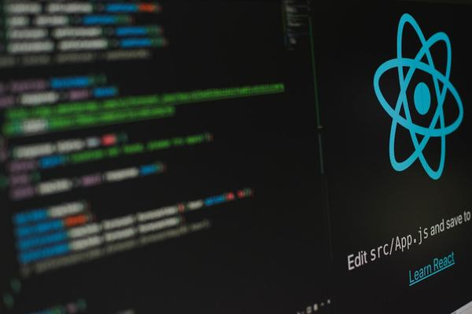

# Cyber Force Academy - E-Learning Platform

A comprehensive Django-based e-learning platform for cybersecurity and AI education. This project demonstrates full-stack web development capabilities with advanced features for course management, student enrollment, and progress tracking.

## 🚀 Features

- **Course Management**: Create, organize, and manage courses with rich content
- **User Authentication**: Secure login/registration system
- **Student Enrollment**: Track enrollments and progress
- **Interactive Lessons**: Engaging course content with multimedia
- **Assessment Engine**: Built-in quiz and exam system
- **Progress Tracking**: Student progress and completion tracking
- **Responsive Design**: Mobile-first responsive UI
- **Admin Interface**: Complete admin functionality for content management

## 🛠️ Tech Stack

- **Backend**: Python, Django
- **Database**: SQLite (default), PostgreSQL ready
- **Frontend**: HTML5, CSS3, Bootstrap 5, JavaScript
- **Images**: AI-generated course visuals
- **Authentication**: Django User system
- **Deployment**: Ready for production deployment

## 📋 Included Courses

- AI Fundamentals and Applications
- Generative AI and Large Language Models
- Agentic AI and Autonomous Systems
- Ethical Hacking and Security Testing
- Penetration Testing and Exploitation
- Introduction to Cybersecurity
- Python for Data Science
- Cloud Security Fundamentals
- Django Web Development

## 🏗️ Project Structure

```
cyber-force-academy/
├── manage.py
├── myproject/
│   ├── __init__.py
│   ├── settings.py
│   ├── urls.py
│   ├── wsgi.py
│   └── asgi.py
├── onlinecourse/
│   ├── __init__.py
│   ├── admin.py
│   ├── apps.py
│   ├── models.py
│   ├── views.py
│   ├── urls.py
│   ├── templates/
│   ├── migrations/
│   └── static/
├── static/
│   ├── admin/
│   └── onlinecourse/
└── requirements.txt
```

## 🚦 Setup Instructions

### Prerequisites
- Python 3.8+
- Pip package manager

### Installation

1. Clone the repository:
```bash
git clone https://github.com/YOUR-USERNAME/cyber-force-academy.git
cd cyber-force-academy
```

2. Create and activate virtual environment:
```bash
python -m venv venv
source venv/bin/activate  # On Windows: venv\Scripts\activate
```

3. Install dependencies:
```bash
pip install -r requirements.txt
```

4. Apply database migrations:
```bash
python manage.py migrate
```

5. Create superuser (optional):
```bash
python manage.py createsuperuser
```

6. Run the development server:
```bash
python manage.py runserver
```

7. Visit `http://127.0.0.1:8000/` to see the application

## 🧪 Running Tests

Execute the test suite:
```bash
python manage.py test
```

## 📸 Screenshots


*Course Listing Page*


*Course Detail View*

## 🤝 Contributing

Contributions, issues, and feature requests are welcome! Feel free to check [issues page](https://github.com/YOUR-USERNAME/cyber-force-academy/issues).

## 📜 License

This project is licensed under the MIT License - see the [LICENSE](LICENSE) file for details.

## 📞 Contact

Your Name - [your.email@example.com](mailto:your.email@example.com)

Project Link: [https://github.com/YOUR-USERNAME/cyber-force-academy](https://github.com/YOUR-USERNAME/cyber-force-academy)

## ⭐ Acknowledgments

- Django framework for the foundation
- Bootstrap for responsive design
- Unsplash for professional course images
- Pillow for image processing
- The open-source community